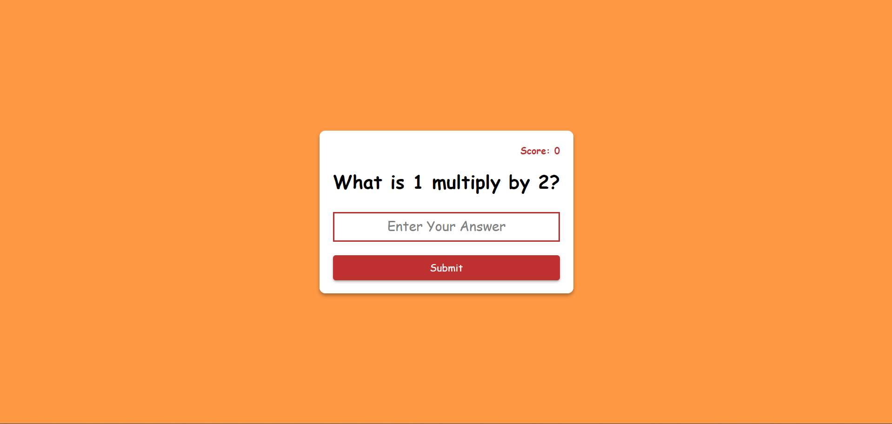
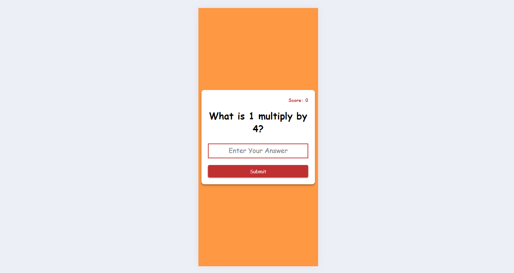

# The Multiplication Web App

## Description :-
This is a type of quiz app which will ask questions regarding multiplication and the user will answer the questions and there wil be a score counting feature.

### Visit the Live Website  :--:  [Multiplication App](     )

---

## Language Used :-

>HTML

>CSS

>JavaScript

## Learned Things :-

- (HTML) The "autofocus" attribute makes the cursor to be blinked over the input field initially when the page get reloaded.

- (HTML) The "autocomplete" attributes of input element gives the access to the browser to sugest the previously entered data to the user.

- (JS) The "Math.ciel()" is used to roundoff the floating point numbers.

- (JS) Use of Callback Function.

- (JS) Type conversion (String to Number & number to string).

- (JS) Use of Local Storage in JavaScript.

  - `localStorage.setItem()` is used to store the data of a variable within the localstorage of the browser.

  - `localStorage.getItem()` is used to access the data from the local storage of the browser.

  - The browser accept only string values for the localstorage.

  - The data retrieved from the localstorage is always in string format
